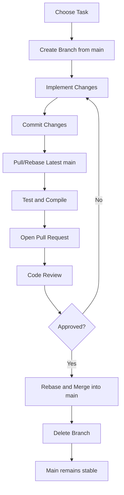

# Git Workflow Plan — Team Effection

## 1. Selected Git Workflow and Rationale

### Selected Workflow: Trunk-Based Development

Our team will use **Trunk-Based Development (TBD)** with short-lived feature branches and Pull Requests (PRs).

The `main` branch is the only long-lived branch. Team members create short-lived branches for individual tasks, complete their work, and integrate it into `main` through a PR.

### Why We Chose This Workflow

This workflow is suitable for our Visual Effects (VFX) project because:

* Our team has multiple members working on the same VFX system.
* Several files may be shared with other teams, so frequent integration helps reduce merge conflicts.
* Small and frequent changes make problems easier to identify and fix.
* Other teams can access completed VFX features without waiting for a long development cycle.
* PRs provide a review process before changes are added to `main`.

Our goal is to keep `main` stable and playable while integrating completed work regularly.

---

## 2. Branch Strategy

We will use the following branches naming convention:

| Branch                  | Purpose                                                     |
| ----------------------- | ----------------------------------------------------------- |
| `main`                  | Main integration branch containing stable and playable code |
| `feature/<description>` | New VFX features or improvements                            |
| `fix/<description>`     | Bug fixes                                                   |
| `docs/<description>`    | Documentation changes                                       |

### Branch Rules

1. Create a branch from the latest `main`.
2. Each branch should focus on **one task or feature**.
3. Keep branches short-lived and merge them as soon as the task is completed and reviewed.
4. Do not create long-lived personal or phase branches.
5. After a branch is successfully merged, delete it.
6. Keep `main` stable and playable at all times.

### Examples

```text
feature/enemy-explosion
feature/player-bullet-trail
fix/particle-leak
docs/vfx-events
```

---

## 3. Commit Rules

### Commit Guidelines

Each commit should contain **one logical change**.

A commit should:

* Be related to the current task.
* Compile successfully.
* Not contain unrelated changes.
* Not include debug code, temporary files, or generated files.
* Keep the game playable whenever possible.

Avoid combining multiple unrelated features into one commit.

### Commit Message Format

We will use the following format:

```text
<type>: <short description>
```

Common types:

| Type       | Usage                   |
| ---------- | ----------------------- |
| `feat`     | New feature             |
| `fix`      | Bug fix                 |
| `docs`     | Documentation           |
| `refactor` | Code restructuring      |
| `perf`     | Performance improvement |
| `chore`    | Maintenance             |

### Examples

```text
feat: add enemy explosion effect
fix: fix particle cleanup
docs: update effect event documentation
perf: reduce particle usage
```

Commit messages should be short, clear, and describe **what was changed**.

---

## 4. Pull Request and Code Review Rules

### Pull Requests

A PR should be opened when the task is implemented and ready for review.

Before opening a PR, the developer must:

1. Pull/rebase the latest `main`.
2. Compile the project.
3. Run the game and test the changes.
4. Check that existing functionality is not broken.
5. Clearly describe the changes and how they were tested.

### Code Review

* Every functional PR must receive **at least one approval** from another team member.
* The author cannot approve their own PR.
* Changes to important shared files should receive a second review when necessary.
* Reviewers should check correctness, readability, possible conflicts, and whether the task requirements are satisfied.
* Requested changes must be completed before merging.

### Direct Push to `main`

**Direct pushes to `main` are not allowed for normal development.**

All feature and bug-fix changes must go through a PR and code review.

Only urgent administrative actions, such as restoring a broken `main`, may be handled directly by the responsible team member.

---

## 5. Merge Strategy

### Strategy

Our team will mainly use **Rebase and Fast-Forward** for feature, fix and docs branches.

Before merging, the branch must be updated with the latest Effection main by rebasing onto it.
After the PR is approved and all tests pass, the changes are integrated into main using a fast-forward merge.


```text
            latest Effection main
                       │
                       ▼
feature/vfx-effect ── rebase ──► feature/vfx-effect
                                      │
                                      │ PR + review
                                      ▼
                                Effection main
                                      │
                                fast-forward
                                      │
                                      ▼
                             updated Effection main
```

### Why Rebase and Fast-Forward?

* Keeps the history simple and linear.
* Makes individual changes easier to understand.
* Reduces unnecessary merge commits.
* Makes it easier to identify and revert problematic changes.

### Merge Commit

Since our team chose Trunk-Based Development (TBD), we aim to integrate small and completed changes into team main frequently while keeping branches short-lived. Therefore, merge commits will not be used for normal feature and bug-fix integration.

Instead, a merge commit may be used when synchronising our team repository with the main class repository (upstream/main) when necessary.

### Conflict Resolution

If a conflict occurs:

1. The branch should first be updated with the latest team main.
2. The **branch author** should resolve the conflict because they understand their changes best.
3. The affected code should be reviewed carefully, especially shared files.
4. The project must be compiled and tested again after resolving the conflict.
5. If the conflict involves another team's work, the affected members should discuss and agree on the correct solution.

---

## 6. Overall Development Workflow

The complete development process is:



### Step-by-Step Process

1. **Choose a task**
   Select a feature, bug fix, or documentation task.

2. **Create a branch**
   Create a short-lived branch from the latest `main`.

3. **Develop**
   Implement the task and make small, logical commits.

4. **Update the branch**
   Rebase with the latest `main` to reduce possible conflicts.

5. **Test**
   Compile and run the game to verify that the changes work correctly.

6. **Open a Pull Request**
   Describe the changes and provide testing information.

7. **Code Review**
   Another team member reviews the PR and requests changes if necessary.

8. **Merge**
   Once approved, rebase and fast-forward the branch into `main`.

9. **Delete the branch**
   Remove the completed branch to keep the repository clean.

10. **Continue development**
    The next task starts from the updated `main`.

---